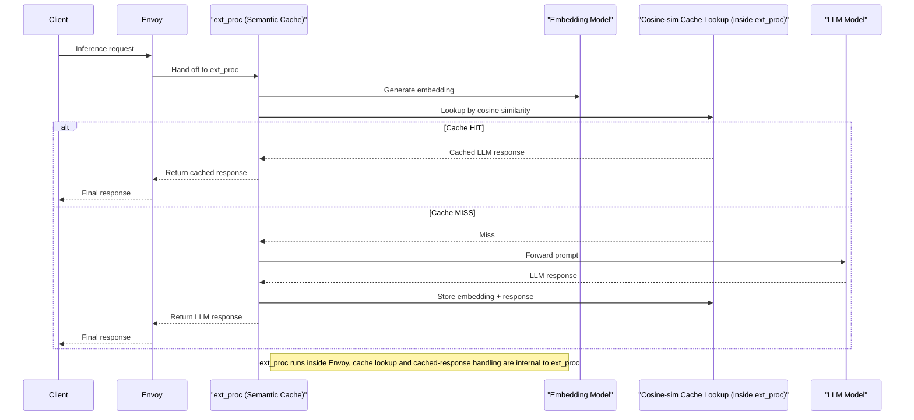

`ext_proc` for LLM Token Usage data

An Envoy `ext_proc` filter for adding Semantic Caching to LLM inference requests. Not recommended for any sort of production scenario.

- Envoy `ext_proc` for semantic caching of LLM responses
- In memory caching of (ideally replaced with FAISS or similar vector store/query service)
- Short-circuit for same prompts


Missing: 

- A proper vector store + querying (e.g. FAISS)
- Configurability re: model, model versioning etc.
- Expiration!

```bash
# From kuadrant/kserve-poc, run:
./setup.sh # Install kServe
./llm-setup.sh # Setup a SmolLM inference model
./embedding-setup.sh  # Setup a SmolLM inference model for embedding
```

Apply filter:

```bash
kubectl apply -f filter.yaml
```

Run ext_proc:

```bash
GATEWAY_HOST=$(kubectl get gateway -n kserve kserve-ingress-gateway -o jsonpath='{.status.addresses[0].value}')
SERVICE_HOSTNAME=$(kubectl get inferenceservice embedding-model -o jsonpath='{.status.url}' | cut -d "/" -f 3)
export EMBEDDING_MODEL_HOST="$SERVICE_HOSTNAME"
export EMBEDDING_MODEL_SERVER="http://$GATEWAY_HOST/v1/models/embedding-model:predict"
./semantic-cache-ext-proc
```

```log
2025/04/23 09:03:02 [Main] EMBEDDING_MODEL_SERVER=http://192.168.97.4/v1/models/embedding-model:predict
2025/04/23 09:03:02 [Main] EMBEDDING_MODEL_HOST=embedding-model-default.example.com
2025/04/23 09:03:02 [Main] ext_proc listening on :50051
```

Tail some logs:

```bash
# Tail the LLM inference pod
kubectl logs -f -l 'serving.kserve.io/inferenceservice=huggingface-llm'

# Tail the embedding model pod
kubectl logs -f -l 'serving.kserve.io/inferenceservice=embedding-model'
```

Call inference with prompt `What is Kubernetes`:

```bash
GATEWAY_HOST=$(kubectl get gateway -n kserve kserve-ingress-gateway -o jsonpath='{.status.addresses[0].value}')
SERVICE_HOSTNAME=$(kubectl get inferenceservice huggingface-llm -o jsonpath='{.status.url}' | cut -d "/" -f 3)

curl -v http://$GATEWAY_HOST/openai/v1/completions \
  -H "content-type: application/json" \
  -H "Host: $SERVICE_HOSTNAME" \
  -d '{"model": "llm", "prompt": "What is Kubernetes", "stream": false, "max_tokens": 10}'
```

Logs:

```bash
# Inference cURL
Calling SmolLM LLM ...
*   Trying 192.168.97.4:80...
* Connected to 192.168.97.4 (192.168.97.4) port 80
> POST /openai/v1/completions HTTP/1.1
> Host: huggingface-llm-default.example.com
> User-Agent: curl/8.7.1
> Accept: */*
> content-type: application/json
> Content-Length: 93
>
* upload completely sent off: 93 bytes
< HTTP/1.1 200 OK
< date: Wed, 23 Apr 2025 08:50:43 GMT
< server: istio-envoy
< content-length: 347
< content-type: application/json
< x-envoy-upstream-service-time: 6832
<
* Connection #0 to host 192.168.97.4 left intact
{"id":"6eca5274-97df-448f-82e5-36ac3a2cedab","object":"text_completion","created":1745398250,"model":"llm","choices":[{"index":0,"text":"?","logprobs":null,"finish_reason":"length","stop_reason":null,"prompt_logprobs":null}],"usage":{"prompt_tokens":7,"total_tokens":9,"completion_tokens":2,"prompt_tokens_details":null},"system_fingerprint":null}
```

```bash
# LLM
2025-04-23 08:50:50.386 uvicorn.access INFO:     10.244.0.27:60956 1 - "POST /openai/v1/completions HTTP/1.1" 200 OK
2025-04-23 08:50:50.387 1 kserve.trace kserve.io.kserve.protocol.rest.openai.endpoints.create_completion: 6.823767900466919 ['http_status:200', 'http_method:POST', 'time:wall']
2025-04-23 08:50:50.388 1 kserve.trace kserve.io.kserve.protocol.rest.openai.endpoints.create_completion: 6.788153999999992 ['http_status:200', 'http_method:POST', 'time:cpu']
```

```bash
# Embedding model
2025-04-23 08:50:38.031 1 kserve.trace Received request N.A.: prompt: ['Kubernetes what is it anyway'], params: None, prompt_token_ids: None, lora_request: None, prompt_adapter_request: None.
2025-04-23 08:50:43.539 1 kserve.trace requestId: 1a186d52-aebd-4739-bbd4-3ac64b8c99c1, preprocess_ms: 74.760198593, explain_ms: 0, predict_ms: 5422.189950943, postprocess_ms: 8.499145508
2025-04-23 08:50:43.544 uvicorn.access INFO:     10.244.0.27:38464 1 - "POST /v1/models/embedding-model%3Apredict HTTP/1.1" 200 OK
2025-04-23 08:50:43.545 1 kserve.trace kserve.io.kserve.protocol.rest.v1_endpoints.predict: 5.528323411941528 ['http_status:200', 'http_method:POST', 'time:wall']
2025-04-23 08:50:43.545 1 kserve.trace kserve.io.kserve.protocol.rest.v1_endpoints.predict: 5.506127000000021 ['http_status:200', 'http_method:POST', 'time:cpu']
```


```bash
# semantic-cache-ext-proc
2025/04/23 09:50:37 [Process] Starting processing loop
2025/04/23 09:50:37 [Process] Handling *ext_procv3.ProcessingRequest_RequestHeaders
2025/04/23 09:50:37 [Process] Handling *ext_procv3.ProcessingRequest_RequestBody
2025/04/23 09:50:37 [Process] RequestBody, end_of_stream=true
2025/04/23 09:50:37 [Process] Prompt: Kubernetes what is it anyway
2025/04/23 09:50:37 [Process] Cache miss, fetching embedding from http://192.168.97.4/v1/models/embedding-model:predict
2025/04/23 09:50:37 [Process] Set Host header: embedding-model-default.example.com
2025/04/23 09:50:38 [Process] Starting processing loop
2025/04/23 09:50:38 [Process] Handling *ext_procv3.ProcessingRequest_RequestHeaders
2025/04/23 09:50:38 [Process] Handling *ext_procv3.ProcessingRequest_RequestBody
2025/04/23 09:50:38 [Process] RequestBody, end_of_stream=true
2025/04/23 09:50:43 [Process] Handling *ext_procv3.ProcessingRequest_ResponseHeaders
2025/04/23 09:50:43 [Process] Handling *ext_procv3.ProcessingRequest_ResponseBody
2025/04/23 09:50:43 [Process] ResponseBody, end_of_stream=true
2025/04/23 09:50:43 [Process] EOF, exiting
2025/04/23 09:50:43 [Process] Embedding responded: 200 OK
2025/04/23 09:50:43 [Process] Stored new embedding len=576
2025/04/23 09:50:43 [Process] Semantic lookup on 0 entries
2025/04/23 09:50:43 [Process] semanticCache empty; no candidate to compare
2025/04/23 09:50:50 [Process] Handling *ext_procv3.ProcessingRequest_ResponseHeaders
2025/04/23 09:50:50 [Process] Handling *ext_procv3.ProcessingRequest_ResponseBody
2025/04/23 09:50:50 [Process] ResponseBody, end_of_stream=true
2025/04/23 09:50:50 [Process] Added semanticCache entry for Kubernetes what is it anyway
2025/04/23 09:50:50 [Process] EOF, exiting
```

Call inference with prompt `Kubernetes what is it anyway`:

```bash
GATEWAY_HOST=$(kubectl get gateway -n kserve kserve-ingress-gateway -o jsonpath='{.status.addresses[0].value}')
SERVICE_HOSTNAME=$(kubectl get inferenceservice huggingface-llm -o jsonpath='{.status.url}' | cut -d "/" -f 3)

echo "Calling SmolLM LLM ..."
curl -v http://$GATEWAY_HOST/openai/v1/completions \
  -H "content-type: application/json" \
  -H "Host: $SERVICE_HOSTNAME" \
  -d '{"model": "llm", "prompt": "Kubernetes what is it anyway", "stream": false, "max_tokens": 10}'
```

```bash
# cURL
Calling SmolLM LLM ...
*   Trying 192.168.97.4:80...
* Connected to 192.168.97.4 (192.168.97.4) port 80
> POST /openai/v1/completions HTTP/1.1
> Host: huggingface-llm-default.example.com
> User-Agent: curl/8.7.1
> Accept: */*
> content-type: application/json
> Content-Length: 93
>
* upload completely sent off: 93 bytes
< HTTP/1.1 200 OK
< content-length: 387
< content-type: text/plain
< date: Wed, 23 Apr 2025 09:08:20 GMT
< server: istio-envoy
<
* Connection #0 to host 192.168.97.4 left intact
{"id":"8d878c06-0847-475b-8542-4fa9698dbf92","object":"text_completion","created":1745399262,"model":"llm","choices":[{"index":0,"text":"?\n\nKubernetes is a container orchestr","logprobs":null,"finish_reason":"length","stop_reason":null,"prompt_logprobs":null}],"usage":{"prompt_tokens":5,"total_tokens":15,"completion_tokens":10,"prompt_tokens_details":null},"system_fingerprint":null}
```


```bash
# LLM
# ...
# Empty (as expected)
```

```bash
# Embedding model
2025-04-23 09:08:15.583 1 kserve.trace Received request N.A.: prompt: ['Kubernetes what is it anyway'], params: None, prompt_token_ids: None, lora_request: None, prompt_adapter_request: None.
2025-04-23 09:08:20.750 1 kserve.trace requestId: e4cb9198-6c08-48a6-9880-7888f8779d0e, preprocess_ms: 1.818656921, explain_ms: 0, predict_ms: 5162.955522537, postprocess_ms: 1.171827316
2025-04-23 09:08:20.751 uvicorn.access INFO:     10.244.0.27:58754 1 - "POST /v1/models/embedding-model%3Apredict HTTP/1.1" 200 OK
2025-04-23 09:08:20.752 1 kserve.trace kserve.io.kserve.protocol.rest.v1_endpoints.predict: 5.1698994636535645 ['http_status:200', 'http_method:POST', 'time:wall']
2025-04-23 09:08:20.752 1 kserve.trace kserve.io.kserve.protocol.rest.v1_endpoints.predict: 5.149951999999985 ['http_status:200', 'http_method:POST', 'time:cpu']
```


```bash
# semantic-cache-ext-proc
2025/04/23 10:08:15 [Process] Starting processing loop
2025/04/23 10:08:15 [Process] Handling *ext_procv3.ProcessingRequest_RequestHeaders
2025/04/23 10:08:15 [Process] Handling *ext_procv3.ProcessingRequest_RequestBody
2025/04/23 10:08:15 [Process] RequestBody, end_of_stream=true
2025/04/23 10:08:15 [Process] Prompt: Kubernetes what is it anyway
2025/04/23 10:08:15 [Process] Cache miss, fetching embedding from http://192.168.97.4/v1/models/embedding-model:predict
2025/04/23 10:08:15 [Process] Set Host header: embedding-model-default.example.com
2025/04/23 10:08:15 [Process] Starting processing loop
2025/04/23 10:08:15 [Process] Handling *ext_procv3.ProcessingRequest_RequestHeaders
2025/04/23 10:08:15 [Process] Handling *ext_procv3.ProcessingRequest_RequestBody
2025/04/23 10:08:15 [Process] RequestBody, end_of_stream=true
2025/04/23 10:08:20 [Process] Handling *ext_procv3.ProcessingRequest_ResponseHeaders
2025/04/23 10:08:20 [Process] Handling *ext_procv3.ProcessingRequest_ResponseBody
2025/04/23 10:08:20 [Process] ResponseBody, end_of_stream=true
2025/04/23 10:08:20 [Process] Embedding responded: 200 OK
2025/04/23 10:08:20 [Process] Stored new embedding len=576
2025/04/23 10:08:20 [Process] Semantic lookup on 1 entries
2025/04/23 10:08:20 [Process] Best candidate: What is Kubernetes with similarity=0.755 (threshold=0.750)
2025/04/23 10:08:20 [Process] similarity 0.755 >= threshold 0.750; cache HIT
2025/04/23 10:08:20 [Process] EOF, exiting
2025/04/23 10:08:20 [Process] EOF, exiting
```


Call inference with prompt `Kubernetes what is it anyway` again - should be a direct cache hit on the prompt:


```bash
GATEWAY_HOST=$(kubectl get gateway -n kserve kserve-ingress-gateway -o jsonpath='{.status.addresses[0].value}')
SERVICE_HOSTNAME=$(kubectl get inferenceservice huggingface-llm -o jsonpath='{.status.url}' | cut -d "/" -f 3)

echo "Calling SmolLM LLM ..."
curl -v http://$GATEWAY_HOST/openai/v1/completions \
  -H "content-type: application/json" \
  -H "Host: $SERVICE_HOSTNAME" \
  -d '{"model": "llm", "prompt": "Kubernetes what is it anyway", "stream": false, "max_tokens": 10}'
```

```bash
# cURL
Calling SmolLM LLM ...
*   Trying 192.168.97.4:80...
* Connected to 192.168.97.4 (192.168.97.4) port 80
> POST /openai/v1/completions HTTP/1.1
> Host: huggingface-llm-default.example.com
> User-Agent: curl/8.7.1
> Accept: */*
> content-type: application/json
> Content-Length: 93
>
* upload completely sent off: 93 bytes
< HTTP/1.1 200 OK
< content-length: 387
< content-type: text/plain
< date: Wed, 23 Apr 2025 09:10:04 GMT
< server: istio-envoy
<
* Connection #0 to host 192.168.97.4 left intact
{"id":"8d878c06-0847-475b-8542-4fa9698dbf92","object":"text_completion","created":1745399262,"model":"llm","choices":[{"index":0,"text":"?\n\nKubernetes is a container orchestr","logprobs":null,"finish_reason":"length","stop_reason":null,"prompt_logprobs":null}],"usage":{"prompt_tokens":5,"total_tokens":15,"completion_tokens":10,"prompt_tokens_details":null},"system_fingerprint":null}
```


```bash
# LLM
# ...
# Empty (as expected)
```

```bash
# Embedding model
# ...
# Empty (as expected)
```


```bash
# semantic-cache-ext-proc
2025/04/23 10:10:05 [Process] Starting processing loop
2025/04/23 10:10:05 [Process] Handling *ext_procv3.ProcessingRequest_RequestHeaders
2025/04/23 10:10:05 [Process] Handling *ext_procv3.ProcessingRequest_RequestBody
2025/04/23 10:10:05 [Process] RequestBody, end_of_stream=true
2025/04/23 10:10:05 [Process] Prompt: Kubernetes what is it anyway
2025/04/23 10:10:05 [Process] Legacy cache hit for embedding
2025/04/23 10:10:05 [Process] Semantic lookup on 1 entries
2025/04/23 10:10:05 [Process] Best candidate: What is Kubernetes with similarity=0.755 (threshold=0.750)
2025/04/23 10:10:05 [Process] similarity 0.755 >= threshold 0.750; cache HIT
2025/04/23 10:10:05 [Process] EOF, exiting
```


## Diagram

